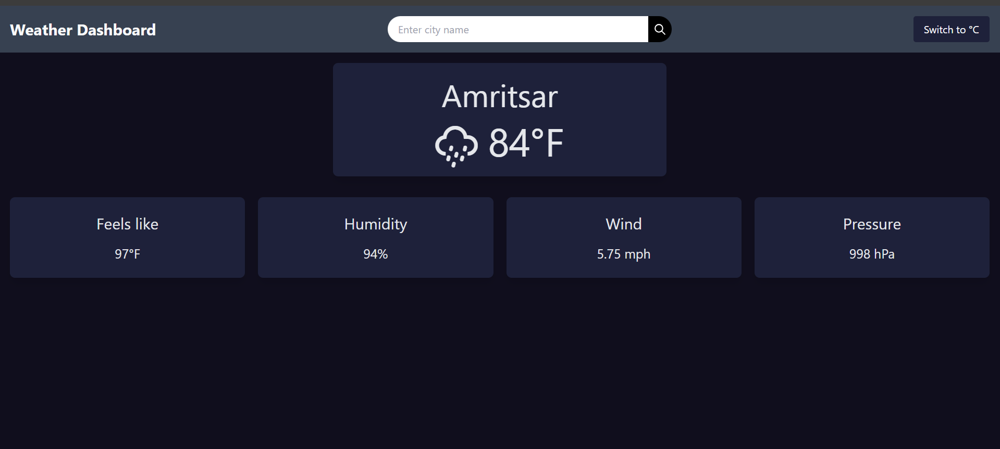

# Weather Dashboard

A responsive weather dashboard application built with React and Tailwind CSS. This application displays real-time weather information for a user-selected city, using data fetched from the OpenWeatherMap API. 

## Features

- **Search Weather:** Enter a city name to get current weather information.
- **Current Location Weather:** By default, it shows the weather for your current location.
- **Temperature Toggle:** Toggle between Celsius and Fahrenheit.
- **Responsive Design:** Works seamlessly across various devices and screen sizes.
- **Smooth Transitions:** Includes smooth animations for better user experience.

## Screenshots



## Getting Started

### Prerequisites

- Node.js and npm installed on your local machine.

### Installation

1. Clone the repository:

    ```bash
    git clone https://github.com/Harpal2000/React_Weather_Dashboard.git
    cd weather-dashboard
    ```

2. Install dependencies:

    ```bash
    npm install
    ```

3. Create a `.env` file in the root directory and add your OpenWeatherMap API key:

    ```
    const apiKey = your_api_key_here
    ```

4. Start the development server:

    ```bash
    npm run dev
    ```

### Project Structure

